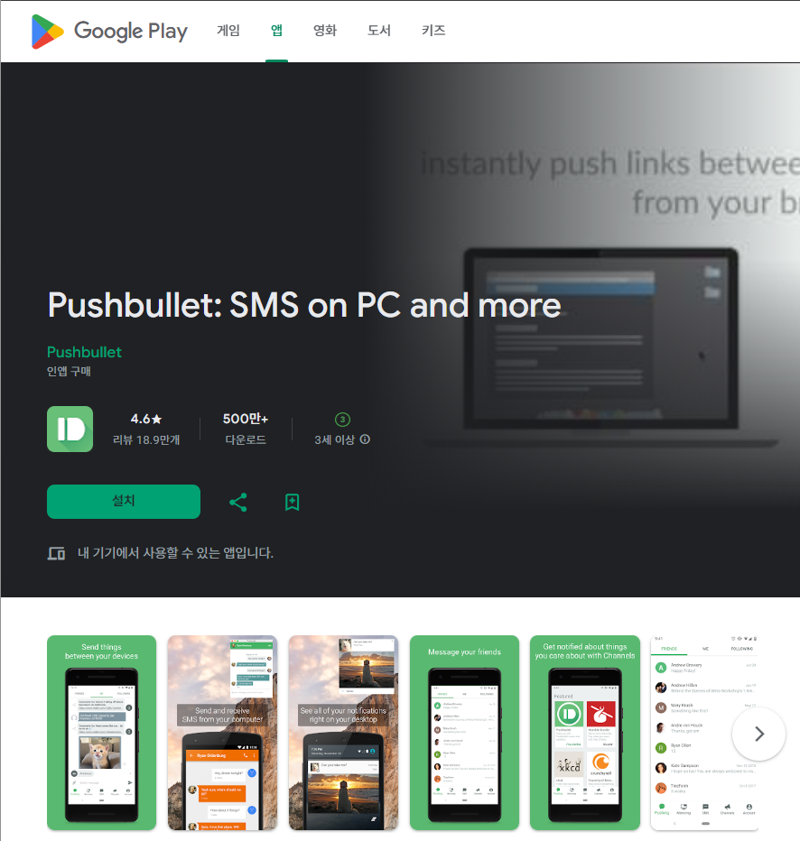
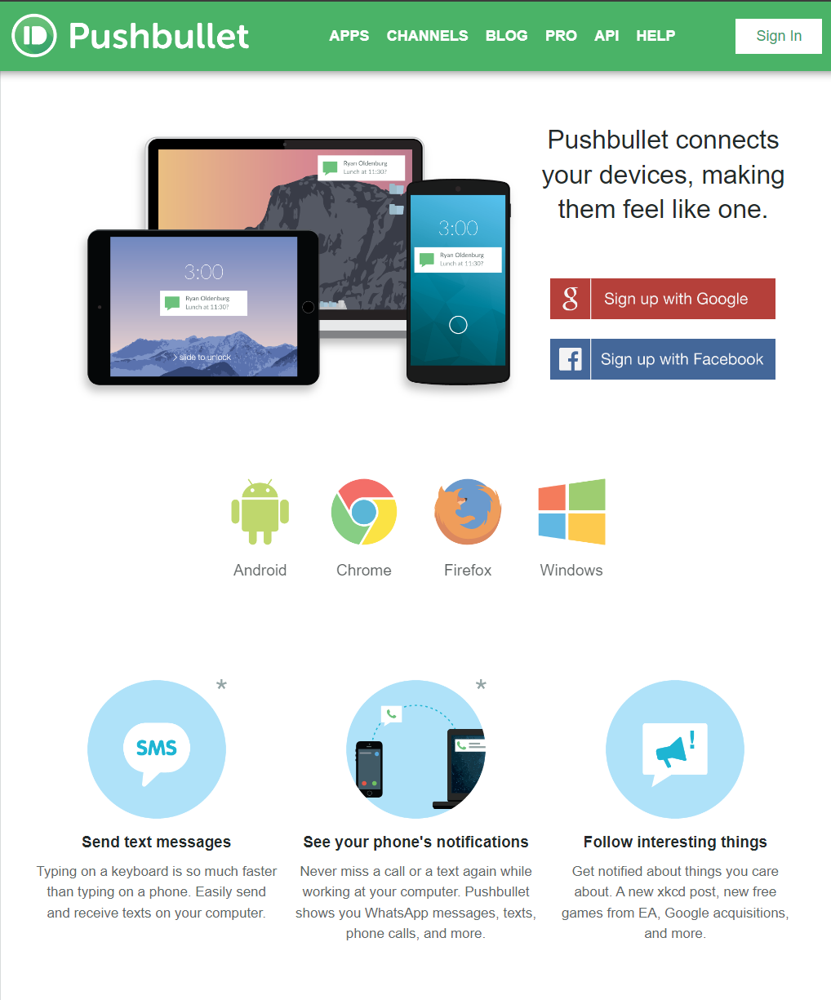
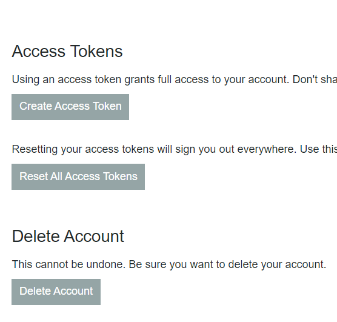
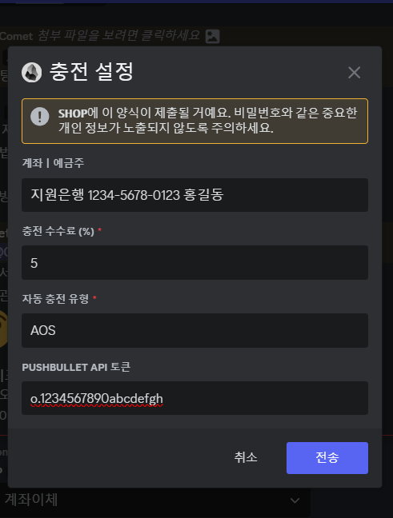

# Comet aAC

### 지원은행 목록

- 우리은행 (우리WON뱅킹)
- 하나은행 (하나원큐)
- 신한은행 (신한SOL뱅킹)
- 국민은행 (KB스타뱅킹)
- 농협은행 (NH콕뱅크 & NH올원뱅크)
- 케이뱅크 (케이뱅크)
- 카카오뱅크 (카카오뱅크) (7777)
- 토스뱅크 (토스뱅크) (1000)

### 입출금 앱 푸시 알림 신청 방법

시작하기 전, 사용하는 은행 앱에서 **입출금 앱 푸시 알림 (SMS 입출금 알림)**을 신청하셔야 합니다.

입출금 앱 푸시 알림 신청 방법은 은행마다 상이하므로, 직접 찾아서 하셔야 합니다.

### 지원하는 은행에 자신이 사용하는 은행이 단 한 개도 없나요?

- 입출금 앱 Push 알림 신청 후 도착한 알림 스크린샷을 보내주시면 해당 은행이 추가됩니다.

## 안드로이드 자동충전 설정방법

플레이 스토어에서 [PushBullet](https://play.google.com/store/apps/details?id=com.pushbullet.android)을 설치 후, 실행하여 로그인(가입)합니다.

- Pushbullet에서 요청하는 모든 알림 권한을 허용한 뒤, 하단의 미러링 탭을 클릭합니다.
- “알림 미러링”을 활성화하고, 나머지(무음 알림 건너뛰기 등등)는 모두 비활성화합니다.

[여기](https://www.pushbullet.com/#settings)를 클릭하여 웹 접속 후 설치 직후 로그인(가입)했던 계정으로 로그인합니다.

Account 탭에서 Create Access Token 버튼을 클릭하여 API 토큰을 생성합니다.

복사 후, 패널 → 충전 설정 → 계좌이체 설정의 PUSHBULLET API 토큰에 붙여넣기합니다.

- 자동충전 유형 입력칸은 “AOS”로 입력한 후 저장합니다..

## 자동충전이 작동하지 않을 경우 해결 방법

1. 자동충전을 지원하는 은행인지 확인해주세요.
2. 안드로이드 OS 버전이 오래되었을 경우 작동하지 않을 수 있습니다.
3. API 토큰이 올바른지, 웹에서 로그인한 계정과 앱에서 로그인한 계정이 같은지 확인
4. 계좌이체 충전 설정에 입력한 계좌와 알림 미러링을 활성화한 은행의 계좌와 일치하는지 확인
5. 알림이 많을 경우 씹힘 현상이 발생할 수 있습니다. 미러링 허용 목록에서 모든 앱을 비활성화 후 사용할 은행 앱만 알림 미러링을 활성화해주세요.