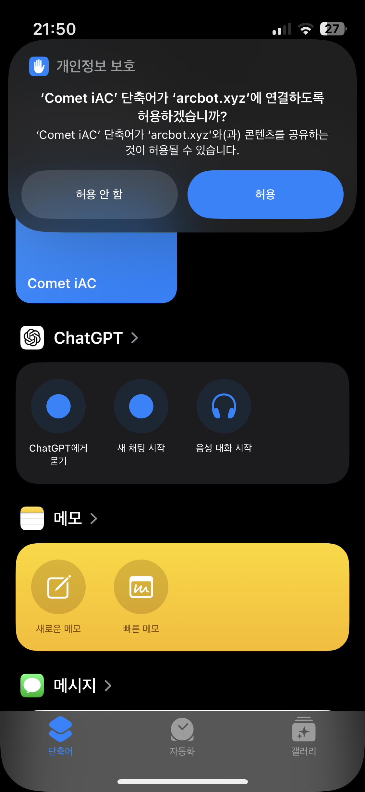

# Comet iAC

### 지원은행 목록
- [ + ] NH농협은행
- [ + ] KB국민은행
- [ + ] IBK기업은행
- [ + ] 부산은행
- [ + ] 우리은행
- [ + ] 카카오뱅크 (7777)

### SMS 입출금 알림 신청 방법
시작하기 전, 사용하는 은행 앱에서 SMS 문자 입출금 알림 (알림톡, 푸시 알림 X)을 신청하셔야 합니다.
SMS 입출금 알림 신청 방법은 은행마다 상이하므로, 직접 찾아서 하셔야 합니다.

### 지원하는 은행에 자신이 사용하는 은행이 단 한 개도 없나요?
- SMS 입출금 알림 신청 후 문자로 도착한 알림 스크린샷을 보내주시면 해당 은행이 추가됩니다.

## 아이폰 자동충전 설정방법

앱스토어에서 “**단축어**” 앱을 설치합니다.

[여기](https://www.icloud.com/shortcuts/c39fef4d9b014b6396d1dea9c9c0ed9a)를 클릭하여 단축어를 설치합니다.

단축어 입력창에 자동충전 토큰, 알림 여부를 설명대로 입력합니다.
- 라이센스 키 : `/설정 -> 정보` 라이센스 키를 복사하여 입력
- 대소문자, O & 0 구분에 유의해주세요.

모든 텍스트를 제거한 후 자동충전에 사용할 **은행 이름을** 입력합니다.
- NH농협은행일 경우 “농협은행” 입력

단축어 앱 하단 → 자동화  → 생성 (+) 버튼 → "메시지" 선택

보낸 사람을 입력했던 은행의 **SMS** **입출금 알림 발송 번호**로 설정합니다.
- "다음 조건으로 메시지를 받을 때" 항목에 은행 입출금 알림 연락처를 선택하면 됩니다.
- 입출금 알림 발송 번호 예시 : https://imgur.com/a/sms-1588-2100-UiAHJQs
- 메시지 포함 내용은 비워두고, **“즉시 실행”** 선택

- 설정했던 Comet iAC 단축어를 동작(자동화)로 설정합니다.

설정을 마친 단축어를 한번 클릭하여 권한을 허용합니다.

디스코드로 돌아가 `/설정 -> 충전 설정 -> 계좌이체` 에서
"자동 충전 유형" 입력 값을 "IOS"로 설정 후 저장합니다.
- IOS 자동충전이기에 하단의 PUSHBULLET API 토큰은 입력하지 않습니다.

## 자동충전이 작동하지 않을 경우 해결 방법
1. 자동충전을 지원하는 은행인지 확인해주세요.
2. **자동화 설정**이 올바르게 되어 있는지 확인해주세요.
3. 라이센스가 올바른지, SMS 입금 알림이 잘 출력되는지 확인해주세요.
4. 이 사용법은 IOS 18 기준으로 작성되었습니다. 17.0 이하 기기는 작동하지 않을 수 있습니다.
