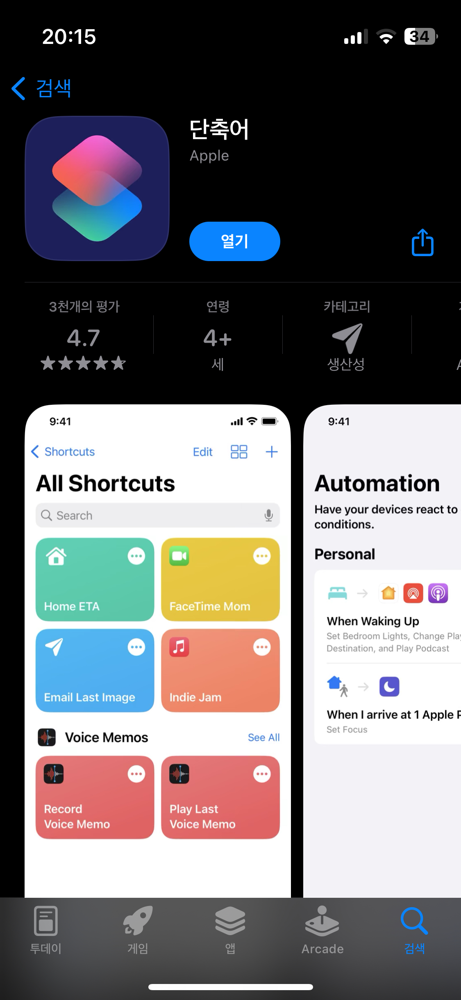
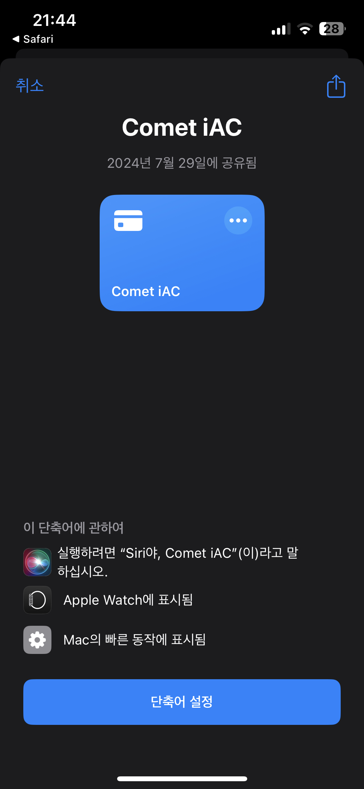
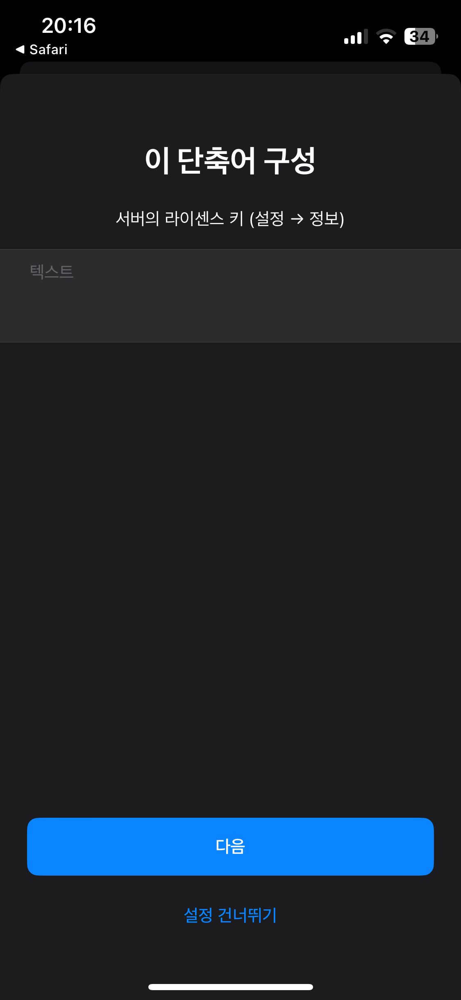
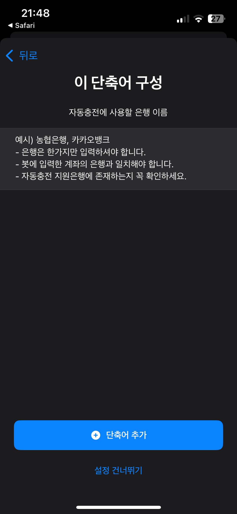
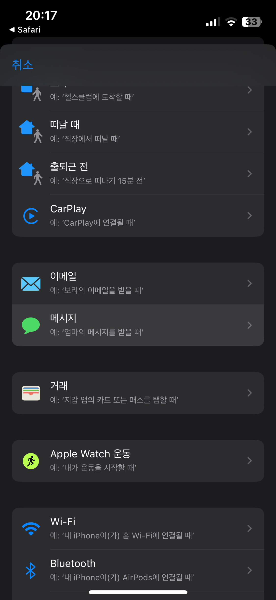
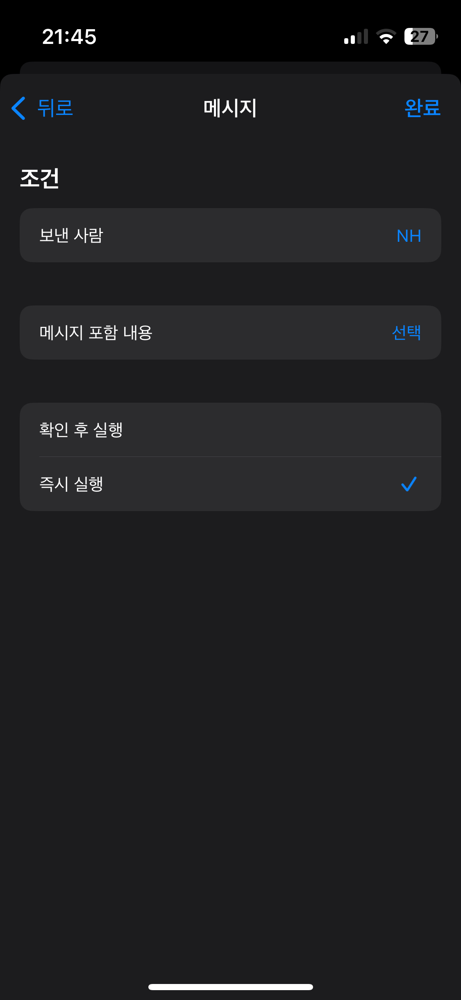
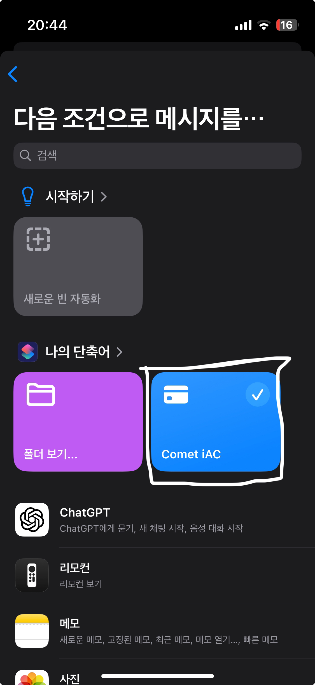
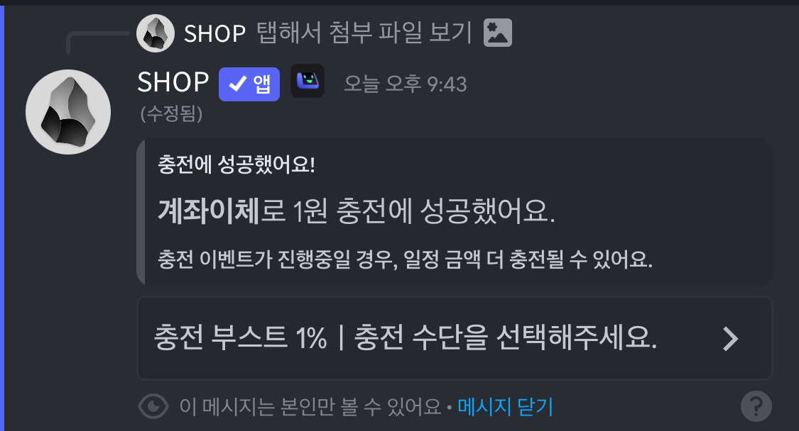

# Comet iAC

### 지원 은행 목록
- 우리은행 (우리WON뱅킹)
- 하나은행 (하나원큐)
- 신한은행 (신한SOL뱅크)
- 국민은행 (KB스타뱅킹)
- 농협은행 (NH콕뱅크 & NH올원뱅크)

### 지원 인터넷 은행 목록
- 케이뱅크 (케이뱅크) (예정)
- 카카오뱅크 (카카오뱅크) (7777)

### SMS 입출금 알림 신청 방법
시작하기 전, 사용하는 은행 앱에서 SMS 문자 입출금 알림을 신청하셔야 합니다. (알림톡, 앱 푸시 알림 X) 
SMS 입출금 알림 신청 방법은 은행마다 상이하므로, 직접 찾아서 신청하셔야 합니다. 

### 지원하는 은행에 자신이 사용하는 은행이 단 한 개도 없나요?
- 토스뱅크는 SMS 입출금 알림을 지원하지 않으므로 영구적 사용 불가합니다.
- SMS 입출금 알림 신청 후 해당 계좌에 1원을 입금하여 도착한 SMS 알림 스크린샷을 지참하여 문의하기로 보내주시면 추후 업데이트합니다. 

## 아이폰 자동충전 설정방법

 
앱스토어에서 “**단축어**” 앱을 설치합니다.  

 
[여기](https://www.icloud.com/shortcuts/c39fef4d9b014b6396d1dea9c9c0ed9a)를 클릭하여 단축어를 설치합니다.  

 
단축어 입력창에 자동충전 토큰, 알림 여부를 설명대로 입력합니다. 
- 라이센스 키 : `/설정 -> 정보` 라이센스 키를 복사하여 입력 
- 대소문자, O & 0 구분에 유의해주세요.  

 
모든 텍스트를 제거한 후 자동충전에 사용할 **은행 이름을** 입력합니다. 
- NH농협은행일 경우 “농협은행” 입력  

 
단축어 앱 하단 → 자동화  → 생성 (+) 버튼 → "메시지" 선택  

 
보낸 사람을 처음 신청하고 입력한 은행의 **SMS** **입출금 알림 발송 번호**로 설정합니다. 
- "다음 조건으로 메시지를 받을 때" 항목에 해당 은행 입출금 알림 연락처를 선택하면 됩니다. 
- [입출금 알림 발송 번호 예시](https://imgur.com/a/sms-1588-2100-UiAHJQs) 
- 메시지 포함 내용은 비워두고, **“즉시 실행”** 선택  

 
- 생성한 자동화에서 Comet iAC 단축어를 선택하여 자동화 동작으로 설정합니다.  

 
디스코드로 돌아가 `/설정 -> 충전 설정 -> 계좌이체` 에서 
"자동 충전 유형" 입력 값을 "IOS"로 설정 후 저장합니다. 
- IOS 자동충전이기에 하단의 PUSHBULLET API 토큰은 입력하지 않습니다. 
- 첫 충전 시 c0met.kr 연결 허용 팝업이 뜨게 됩니다. 허용해주세요.  

 

## 자동충전이 작동하지 않을 경우 해결 방법
1. 자동충전을 지원하는 은행인지 확인해주세요. 
2. **자동화 설정**이 올바르게 되어 있는지 확인해주세요. 
3. 라이센스가 올바른지, SMS 입금 알림이 잘 출력되는지 확인해주세요. 
4. 이 사용법은 IOS 18 기준으로 작성되었습니다. 17.0 이하 기기는 작동하지 않을 수 있습니다. 
